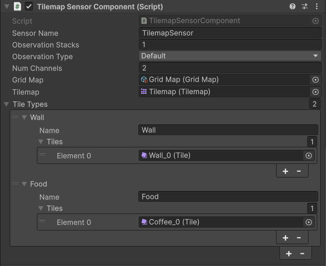
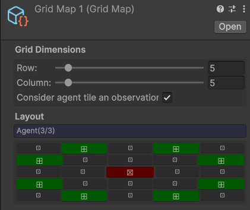

# Tilemap Sensor
This is a sensor for the [Unity Machine Learning Agents Toolkit](https://github.com/Unity-Technologies/ml-agents). 
It is compatible with [v3.0.0 / release 22](https://github.com/Unity-Technologies/ml-agents/releases/tag/release_22).

# Installation
1. Make sure git is installed in your system.
2. Open [Package Manager](https://docs.unity3d.com/Manual/upm-ui.html).
3. Click the  **+**  button, and choose  **Add package from git URL**.
4. Type in `https://github.com/ReviXy/TilemapSensor.git`.

# Tilemap Sensor Component
  
### Sensor Settings
- `Sensor Name`  - Name of the generated grid sensor.
- `Observation Stacks`  - The number of stacked observations.
- `Observation Type`  - The observation type for the sensor,  `Default`  or  `Goal Signal`.
- `Num Channels` - The number of channels (channel with index 0 is reserved for tile type observation).
- `Tilemap` - The tilemap sensor will work with.
- `Grid Map` - Scriptable object that defines captured tiles positions.
- `Tile Types` - List of groups of tiles. Each group has a name and its tile list.

### Grid Map
   
 Grid map is a scriptable object that is used to optimize the amount of input data for agent. 
 You can select the size of display grid and then mark the agent cell and captured cells by clicking the buttons on grid. Coordinates of captured cells are calculated relatively to agents cell position, so it doesn't matter if you make the grid too big.
Note that you can capture information about the cell where agent currently is by turning on corresponding flag.

### Implementing additional observations
You can feed additional observations to tilemap sensor by writing values directly to TilemapBuffer (note that channel with index 0 is reserved for tile type observation).
To get access to TilemapBuffer use: `GetComponent<TilemapSensorComponent>().m_TilemapBuffer`.

# Examples
## Maze Explorer
An agent moves stepwise through a random maze. Its tilemap sensor observes 2 channels: tile type (one-hot observation: wall, food or empty tile) and visit values. The visit value for each maze cell increases everytime the agent moves onto, or stays on it. An episode ends when any of the cells' visit value reaches 1. Rewards are inversely proportional to this value: +0.5 for every new cell the agent discovers, and incrementally less if it stays or returns to it. The reward for finding food is +1.

# Dependencies
-   [ML-Agents 3.0](https://docs.unity3d.com/Packages/com.unity.ml-agents@3.0/manual/index.html)
